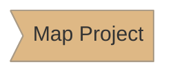
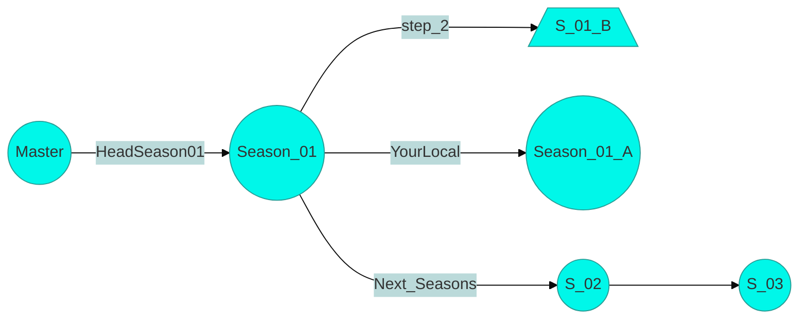

#  COMPILER || #branch_01_A
<br/><br/>


## Tutorial typescript iniciante Season_01 `by:@TeoNogueira` [RepoLink].
<br/><br/>
### Vamos abordar sobre compilador.


# Text under construction 👷‍♂🧾 ....

<br/><br/>

## Lembrando

Instalação do [Typescript].

use `-g` para instalar de forma global.

* installe o coderunner

### Para executar o comando do coderunner(ctrl + alt + n) com ts instale:
 ```sh 
 npm i -g ts-node 
```


## Outros:

* ``` tsc -v``` << "Version".

* ``` tsc --init``` << create file >> "tsconfig.json" instale logo após a instalação do ts.

* ``` npm init -y```

* tsc e o nome do arquivo ts para criar uma réplica em js e poder ser executado.

* ``` tsc -w``` <<< monitorando -- compila o javascript automaticamente em tempo real.
#
<br/>






#

[RepoLink]: https://github.com/TeoNogueira/TypeScript-2022
[Typescript]: https://www.npmjs.com/package/typescript
[Teonogueira]: https://github.com/postcss/sugarss
[Package Control]: https://packagecontrol.io/

## <div align="center">`Adicione esse repositório na sua lista de favoritos!`</div>
